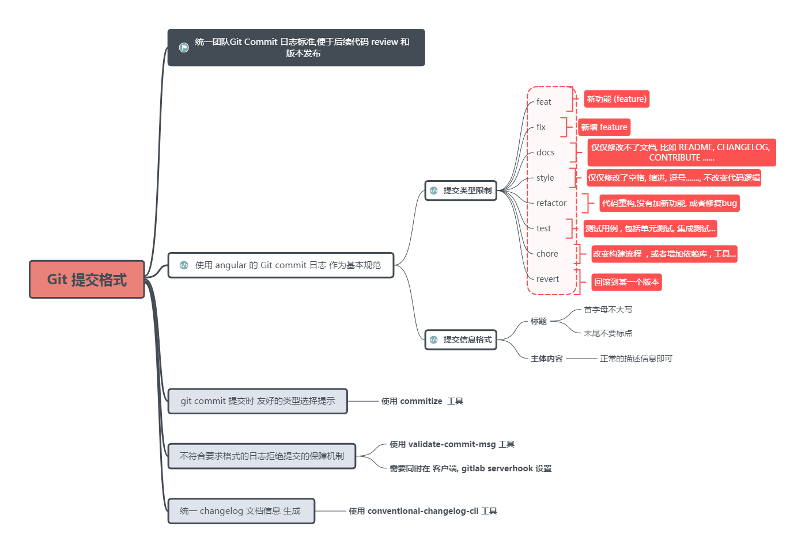

# commit提交规范与version自动更新环境搭建

# commit提交规范



基础格式如下：

```txt
<type>(<scope>): <subject>
<BLANK LINE>
<body>
<BLANK LINE>
<footer>
```

## commit 规范检查环境

1、commitizen：辅助我们生成规范的commit（类使用vue-cli，我们通过选择就可以生成规范的commit）
2、commitlint：检查我们的commit是否符合规范
3、husky：**git相关hooks，可以在git相关动作中插入一些事情**

husky环境搭建：
1、安装husky：`pnpm add husky -D -w`
2、初始化 Husky 并创建 Git hooks：`npx husky install`
3、然后添加一个 commit-msg 钩子来检查提交信息：
`echo '#!/bin/sh\nnpx --no-install commitlint --edit "$1"' > .husky/commit-msg`
4、创建 commitlint.config.js 文件

```js
// commitlint.config.js
module.exports = {
  extends: ["@commitlint/config-conventional"]
}
```

5、在 `package.json` 添加 prepare scripts 脚本。

```json
"scripts": {
  "prepare": "npx husky install"
}
```

`package.json` 中有两种脚本，一种是自定义脚本，这种我们经常用；另一种是生命周期脚本，比如 prepare、preinstall、prepublish等，这些脚本在特定的生命周期阶段会**自动运行**。

### 关于 husky

其实简单来说 husky 就是在 git hooks 上进行了封装，简化了相关操作 API，类似于 webpack-chain。

我们原始 git 是支持在仓库根目录下创建 `.git/hooks` 文件夹，类配置相应的 git 钩子。husky 工具帮我们简化了配置，同时设置了 `.husky` 配置文件夹。

# 参考

[Git Commit 规范](https://feflowjs.com/zh/guide/rule-git-commit.html)
[git commit规范及自动检查工具安装小记](https://juejin.cn/post/6844904033635794958)
