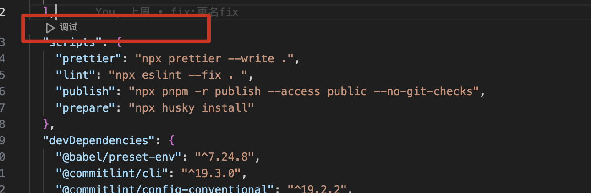
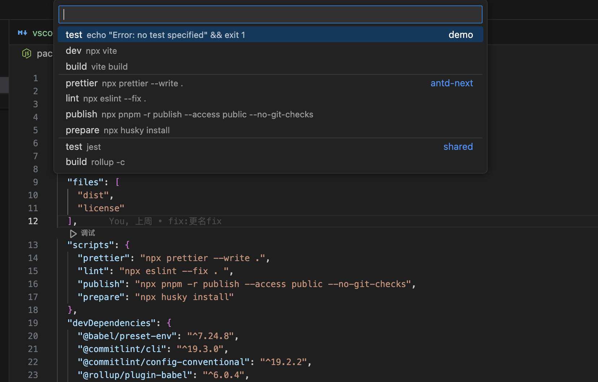

# 方式一：

在 `package.json` 中找到 `scripts`，点击小的 debugger 按钮。



选择对应的 script 进行 debugger



# 方式二：

在 `.vscode/launch.json` 中添加对应的配置，然后点击调试按钮。

在 Visual Studio Code 中，launch.json 文件用于配置**调试器的启动配置**。这个文件包含调试器如何启动、连接到应用程序以及调试过程中使用的各种选项。以下是 launch.json 文件的基本配置项及其作用：

## 基本配置项

### 1、version:

- 作用: 定义 launch.json 文件的版本。
- 示例: "version": "0.2.0"

### 2、configurations:

- 作用: 包含一个或多个调试配置，每个配置定义了一个独立的调试会话。
- 示例:

```json
"configurations": [
  {
    // 配置项在这里
  }
]
```

## 每个调试配置的常见属性

### 1、name:

- 作用: 配置的名称，在调试配置下拉列表中显示。
- 示例: "name": "Launch Program"

### 2、type:

- 作用: 指定调试器的类型，如 node、chrome、python 等。
- 示例: "type": "node"

### 3、request:

- 作用: 指定调试请求的类型，可以是 launch 或 attach。launch 启动程序进行调试，attach 连接到正在运行的程序进行调试。
- 示例: "request": "launch"

### 4、program:

- 作用: **要调试的程序的入口文件路径**。
- 示例: "program": "${workspaceFolder}/src/index.js"

### 5、args:

- 作用: 启动程序时传递的命令行参数。
- 示例: "args": ["arg1", "arg2"]

### 6、cwd:

- 作用: 设置程序运行时的工作目录。
- 示例: "cwd": "${workspaceFolder}"

### 7、env:

- 作用: 设置程序运行时的环境变量。
- 示例: "env": { "NODE_ENV": "development" }

### 8、outFiles:

- 作用: **设置包含源映射文件的输出文件，用于调试 TypeScript 或 Babel 转译后的代码**。
- 示例: "outFiles": ["${workspaceFolder}/dist/**/*.js"]

### 9、sourceMaps:

- 作用: 启用源映射支持，以便调试转译后的代码。
- 示例: "sourceMaps": true

### 10、preLaunchTask:

- 作用: 在启动调试之前运行的任务名称，通常用于编译或构建项目。
- 示例: "preLaunchTask": "npm: build"

在 VSCode 中，你可以使用多种类型的任务作为 preLaunchTask，包括 npm、gulp、shell、make 和 grunt 等。确保在 **tasks.json** 中正确配置任务，并在 launch.json 中引用相应的任务标签，以便在启动调试会话之前自动执行所需的任务。（**npm 可以不要配合 task.json 使用，其他的需要配合 task.json 使用**）

### 11、internalConsoleOptions:

- 作用: 控制内部调试控制台的行为。可选值为 neverOpen、openOnSessionStart、openOnFirstSessionStart。
- 示例: "internalConsoleOptions": "openOnSessionStart"

### 12、skipFiles:

- 作用: 在调试过程中跳过指定的文件或文件夹。
- 示例: "skipFiles": ["<node_internals>/**"]

### 13、port:

- 作用: 在 attach 模式下，指定调试器连接的端口。
- 示例: "port": 9229

## 完整示例

以下是一个完整的 launch.json 示例，用于调试 Node.js 应用程序：

```json
{
  "version": "0.2.0",
  "configurations": [
    {
      "name": "Launch Program",
      "type": "node",
      "request": "launch",
      "program": "${workspaceFolder}/src/index.js",
      "outFiles": ["${workspaceFolder}/dist/**/*.js"],
      "sourceMaps": true,
      "preLaunchTask": "build",
      "cwd": "${workspaceFolder}",
      "env": {
        "NODE_ENV": "development"
      },
      "internalConsoleOptions": "openOnSessionStart",
      "skipFiles": ["<node_internals>/**"]
    }
  ]
}
```

配置项详细解释

- version: 定义了 launch.json 的版本，通常为 "0.2.0"。
- configurations: 包含所有调试配置项，每个配置项定义了不同的调试会话。
- name: 配置项的名称，显示在调试配置下拉列表中。
- type: 指定调试器的类型，如 Node.js (node)。
- request: 指定调试请求的类型，可以是 launch（启动调试）或 attach（附加到正在运行的进程）。
- program: 要调试的程序的入口文件路径。
- outFiles: 定义调试时使用的输出文件，用于调试生成的代码。
- sourceMaps: 启用源映射支持。
- preLaunchTask: 在启动调试之前运行的任务。
- cwd: 定义程序运行时的工作目录。
- env: 设置程序运行时的环境变量。
- internalConsoleOptions: 控制内部调试控制台的行为。
- skipFiles: 在调试过程中跳过指定的文件或文件夹。
