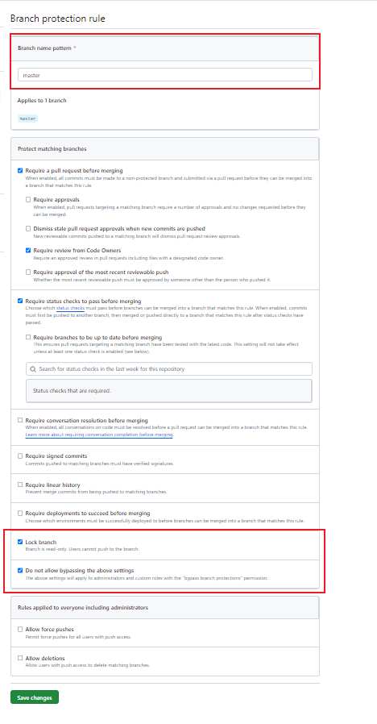

# 分支管理

初步设计采用这样的管理方式：

1. 首先区分两个基本的分支：master 和 dev。dev 作为小迭代分支，可以频繁的 commit，而只有当功能相对稳定且通过测试后，可以**合并到 master 进行封版**。同时**如果是大版本的话，需要打上 tag**。

2. **自动构建与发布的流程放在云端**。如果放在本地的思路是编写自动构建相关脚本，而放在云端的思路则是**使用仓库管理工具提供的 workflow**。

关于代码管理的几个基本需求：

1、希望在每次 commit 的时候，可以进行一次代码检查以及代码格式化（这样可以保证代码整体的风格质量）。
    配置 .git/hooks pre-commit
2、希望有一个 demo 页面
    GitHub Pages
3、希望在推送 master 的时候，可以自动发布到 npm，同时打包构建静态页面，推送到 GitHub Pages

# 分支保护

我们希望我们的 master 作为一个**稳定的**生产分支。那么 master 的代码就不能随意变动，我们仅开放向 master 合并功能，关闭向 master 推送的功能。配置如下：

